<h1 align="center">Xtreme Fitness Club<a name="#top"></a></h1>
<h1 align="center"></h1>

<a name="introduction"></a>
## Introduction
*Xtreme Fitness Club* they are fitness enthusiast who would love to share their love of health and fitness with others.
The website designed for business purpose offering personal trainning programs, group tranning programs, apparels and nutritional products.
What more perfect place to purchase these things than a trusted fitness center? 

This is my final project of four Milestone Projects that make up the Full-Stack Web Development Diploma Training at [Code Institute](https://codeinstitute.net/). The goal of this project was to build a full-stack website with the use of HTML, CSS, JavaScript, Python, Django and a relational database; as well as the implementation of a checkout functionality, which has been achieved through the use of Stripe.

Xtreme Fitness is Python-Django web application, support by a PostgreSQL (and SQLite3) database, and deployed via the Heroku PaaS. This project uses the Stripe Checkout API (for educational purposes only: not currently taking real card payments) and is styled using the Bootstrap Grid System.

**NOTE:** If you would like to test the payment functionality of this project, NO NEED to create an account. Use the card number 4242 4242 4242 4242 with ANY address details, expiry date and CVC that you choose.


[Click here to view the project live.](https://xtreme-fitness.herokuapp.com/)


<div align="right"><a href="#top">🔝</a></div>


## Table of Contents

- [Introduction](#introduction)

- [User Experience](#ux)

  - [Wireframe](#wireframe)
  - [Color Palette](#color-palette)
  - [App Logo](#app-logo)

- [User Stories](#user-stories)

- [Database Structure](#database-structure)

  - [Profiles App](#profiles-app)
  - [Products App](#products-app)
  - [Blog App](#blog-app)
  - [Subscribe App](#subscribe-app)

- [Features](#features)

- [Mockup](#mockup)

- [Technologies Used](#technologies)

- [Testing](testing)

- [Deployment](deployment)

  - [Local-Deployment](#local-deployment)
  - [Heroku-Deployment](#local-deployment)

- [Credits](#credits)

<a name="ux"></a>

## User Experience (UX)

<a name="wireframe"></a>

### Wireframe
Link to the wireframe on [here](https://github.com/szilG/Xtreme-Fitness/tree/main/readme/wireframes)

<a name="color-palette"></a>

### Color Palette

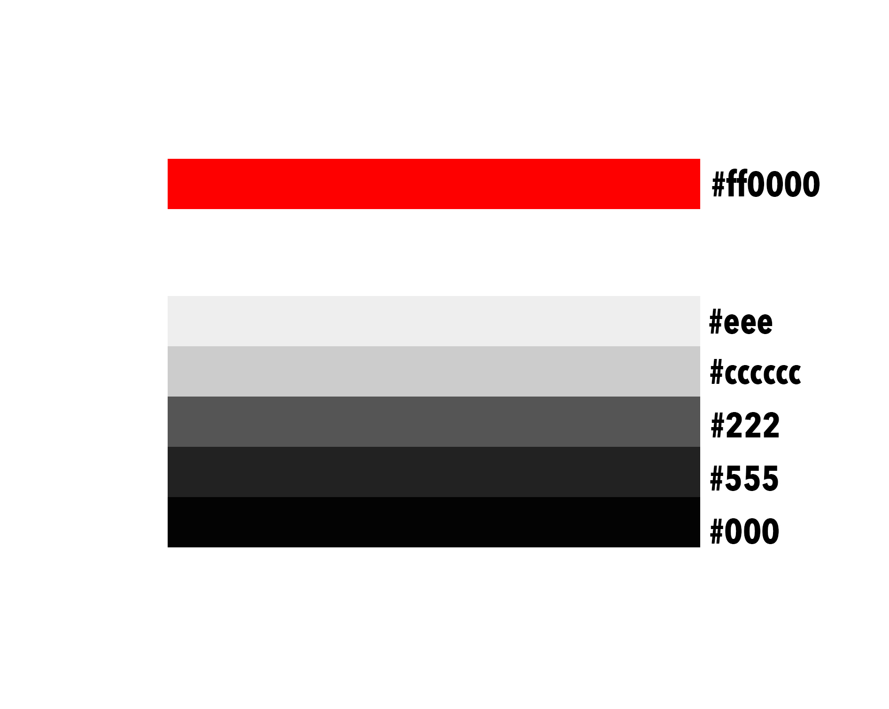

<a name="app-logo"></a>

### App Logo
*Xtreme Fitness Club Favicon*

 


<div align="right"><a href="#top">🔝</a></div>


<a name="user-stories"></a>

## User Stories

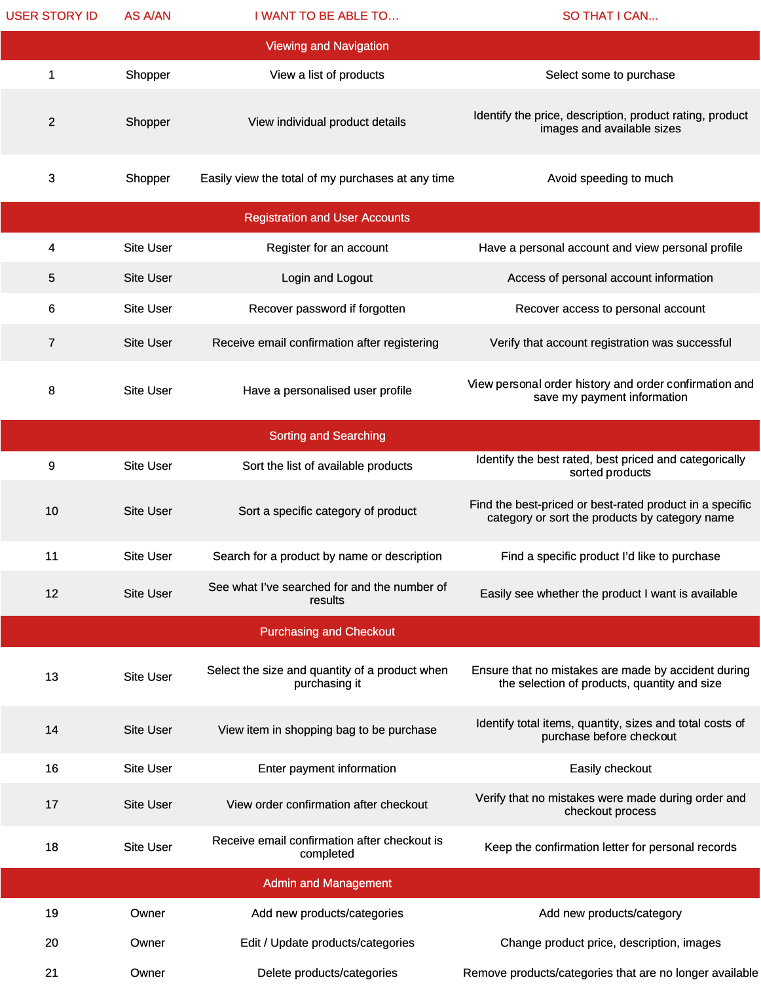


Three main users were created:

1.	Superuser (admin) can add products, description of product, price and image.
2.	General browsing users who are potential customers who have browsed on to the website but did not register
3.	Authenticated users who are customer of the site by registering (adding their contact details and creating a user and password)


<div align="right"><a href="#top">🔝</a></div>

<a name="database-structure"></a>

## Database Structure 

Xtreme Fitness Club site is built on Django, and uses the SQLite3 database during all development stages. Through the deployment to Heroku, the database was changed to a PostgreSQL database as that is provided by Heroku as an add-on for production.

The Django’s default user model for authorization is also in use, which allows the project to meet one of the main requirements of separating features by anonymous users, users in session and superusers.

The structure of the apps are inspired by one of Code Institute's mini projects: _Boutique Ado_.


<a name="profiles-app"></a>

### Profiles App

#### UserProfile Model


| **Name** | **Database Key** | **Field Type** | **Validation** |
--- | --- | --- | --- 
 User | user | OneToOneField 'User' |  on_delete=models.CASCADE
 Phone number | default_phone_number | CharField | max_length=20, null=True, blank=True
 Address Line1 | default_street_address1 | CharField | max_length=80, null=True, blank=True
 Address Line2 | default_street_address2 | CharField | max_length=80, null=True, blank=True
 Postcode | default_postcode | CharField | max_length=20, null=True, blank=True
 Town/City | default_town_or_city | CharField | max_length=40, null=True, blank=True
 County | default_county | CharField | max_length=80, null=True, blank=True
 Country | default_country | CountryField | blank_label='Country', null=True, blank=True


<a name="products-app"></a>

### Products App

#### Product Model

| **Name** | **Database Key** | **Field Type** | **Validation** |
--- | --- | --- | --- 
 Category | category | ForeignKey 'Category' | null=True, blank=True, on_delete=models.SET_NULL
 Sku | sku | CharField | max_length=254, null=True, blank=True
 Name | name | CharField | max_length=254
 Description | description | TextField |max_length=700
 Sizes | has_sizes | BooleanField | default=False, null=True, blank=True
 Price | price | DecimalField | max_digits=6, decimal_places=2
 Rating | rating | DecimalField | max_digits=6, decimal_places=2, null=True, blank=True
 Image URL | image_url | URLField | max_length=300, null=True, blank=True
 Image | image | ImageField | null=True, blank=True
 Long_description | long_description | TextField | null=True, blank=True
 Image_2 | image_2 | ImageField | null=True, blank=True

#### Category Model

| **Name** | **Database Key** | **Field Type** | **Validation** |
--- | --- | --- | ---
Name | name | CharField | max_length=254
Friendly Name | friendly_name | CharField | max_length=254, null=True, blank=True

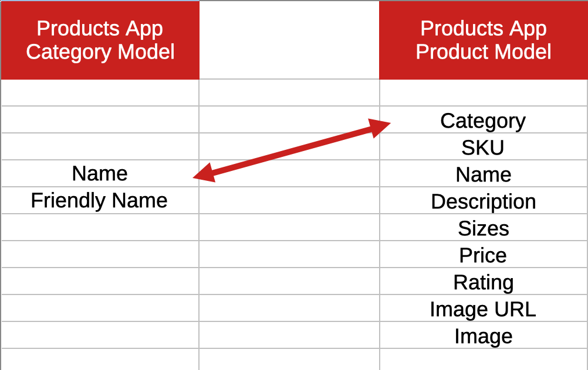


<a name="blog-app"></a>

### Blog App

#### Post Model

| **Name** | **Database Key** | **Field Type** | **Validation** |
--- | --- | --- | ---
Title | title | CharField | max_length=254
Slug | slug | SlugField | null=True, blank=True
Intro | intro | TextField |
Image_url |image_url | URLField | max_length=1024, null=True, blank=True
Image |image | ImageField | null=True, blank=True
Body |body| TextField | 
Body_sub_header |body_sub_header | TextField| null=True, blank=True
Body_text | body_text | TextField | null=True, blank=True
Date_added | date_added | DateTimeField | auto_now_add=True


#### Comment Model

| **Name** | **Database Key** | **Field Type** | **Validation** |
--- | --- | --- | ---
Post | post | ForeignKey Post, related_name='comments' | null=True, blank=True, on_delete=models.SET_NULL
Name |name | CharField | max_length=254
Email | email | EmailField
Body |body| TextField 
Date_added | date_added | DateTimeField | auto_now_add=True


<a name="subscribe-app"></a>

### Subscribe App

#### Subscribe Model

| **Name** | **Database Key** | **Field Type** | **Validation** |
--- | --- | --- | ---
Email | email | EmailField | max_length=254, unique=True
Date_added | date_added | DateTimeField | auto_now_add=True


<div align="right"><a href="#top">🔝</a></div>


<a name="features"></a>

## Features

### Existing Features

#### Consistent features across all pages

- The menu at the top of the page and footer at the bottom are consistent in design and are responsive throughout the website.
- The header is positioned to always be visible at the top of the screen (mobile and desktop) which allows visitors to find it quickly.
- There are two header on page. One is main navigation menu and other is mobile top header.
- The navbar contains the logo, search box, links to access user acconts and shopping bag and the navigation links.
- On click to My Acconts the user will find the Sign In or Register forms, prompting them to access the parts of the website that require authentication.
- Regular registered users can check and edit their profile details and check their order history.
- Admin with superuser privileges can add, edit and delete products, categories from the database.
- Registered users can click Log out under My Acconts that verifies that a user wishes to leave the site, with a 'Sign Out' button. Once signed out, users are redirected back to the Home page.
- A Search box is part of the top navigation and accessible on all pages. It allows customers to enter keywords associated with the products they wish to purchase. The Search box is dynamically connected to the database.
- The authentication pages (Sign In, Sign Up & Sign Out) were built with Django, and therefore include all Django's builtin features (including requesting an email for forgotten passwords.)
- Each page features a 'scroll to top' button that becomes visible when the user has scrolled down the page.
- Each page on large device when the user 'scroll down' the transparent background change to black. That allows the navbar to be visible when the user has scrolled down the page.
- All toast messages appear in the right corner under the menu bar. Depending on the type of message, the toast colour changes to reflect this message. The purpose of is to provide the user confirmation of actions like sign out etc.
- All of the Social links are in the footer and they're change color on hover.


#### Specific to the pages

**Home Page**

 - The user begins by seeing the carousel images with a Join Us action button.
 - Then scrolls down to see 3 services section each field is clickable call to action button. 
 - Below this, the user sees a little about info that features buttons to the trainning plans page.
 - Below this, the user sees a membership section wich tells the user what are the benefits if they become a member and features with a call to action button.
 - Below this, the user sees the testimonials of previous customers with their names and pictures.
 - Bellow this, the user sees the contact section with a map, contact info and a contact form. That section contains the subscribe newsletter button.


**About Page**

 - The user begins by seeing the motivation hero image with a caption text.
 - Then scrolls down to see a little about info that features buttons to the trainning plans page.
 - Bellow this, the user sees 3 services section each field is clickable call to action button.
 - Bellow this, the user sees the trainers section with their images, names and their socials links.
 - Bellow this, another section from the fitness club benefits and the contact us button. That section contains the subscribe newsletter button.


**Trainning Plan page (All Trainning)**

 - The user begins by seeing the motivation hero image.
 - This page contains the list of programs based on category with image and price.


**Shop Page (All Products)**

 - The user begins by seeing the motivation hero image.
 - This page contains the list of products based on category with image and price.


**Product Description Page**

 - This page displays product description of selected product with price, rating, size if has any, quantity box and add to bag and keep shopping link.


**Contact Page**

 - The user begins by seeing the motivation hero image with a caption text.
 - This page contains a contact form where users can ask questions. Also the page contains a map and contact information about Xtreme Fitness Club.
 - That page contains the subscribe newsletter button.


**Blog Page**

 - The user begins by seeing the motivation hero image with a caption text.
 - Bellow this, the blog content with image, intro text, the date when it was added and a read more action button.


**Blog Details page**

 - The user begins by seeing the blog image on the top.
 - Bellow this, the blog post with a header text, intro text, the date when it was added, and a bake to Blog Home button.
 - Bellow this, the comment section when the users can leave comments for the particular post.


**Register Page**

 - This page has signup form. After registration user will reach the sign in page.
 - After sign in the user will reach the home page.


**Log In Page**

 - This page has login form. After login user will reach on home page.


**Profile Page**

 - This page contains user details, delivery info with an update information button and the user order history.


**Log Out Page**

 - This page has logout form with confirmation Sing Out button to logout. Once signed out, users are redirected back to the Home page.


**Product Managment Page**

 - Only admin can access this page. Admin with superuser privileges can add, edit and delete products, categories from the database.


**Bag Page**

 - This page has list of all products added to the bag with image, price, quantity, delivery info and amount of the total price. 
 Also contains a secure checkout and keep shopping link.


**Checkout Page**

 - This page contains a form of user details, delivery information and the payment method. Also users can save their delivery information to their profile.
 - Bellow that, a Compate order and a Back button.
 - This page also contains order summary of the purchased products.
 - A red overlay with a spinner gif appears after checkout is initiated and while the transaction is being processed and until the checkout success page has fully loaded.


**Checkout Success Page**

 - This page has confirmation Thank You message of your payment for order. This page contains the orders and user deatils and a go back to home page link.
 - Also on the upper right corner toast message appears with a success or failure.


**Subscribe Page**

 - This page has a hero image with a text caption.
 - Bellow that, a call to action text with a header and a paragraph.
 - Bellow that, aa subscribe form for getting the newsletter. Just by entering email address you become subscriber.


<div align="right"><a href="#top">🔝</a></div>

### Features Left to Implement

- Build in a costumer comment section to the product details page where the costumers can leave feetbacks and images of the product, company, delivery info, ect.
- Create a clickable timetable where the users can book any classes or cancel their bookings.
- Create a page with online video tainnings and/or nutrition coaching app.
- Build to sign-in or register with social acconts.

<a name="mockup"></a>

## Mockups

- Mockup made through original website on [Techsini](https://techsini.com/multi-mockup/index.php)

    - Home

   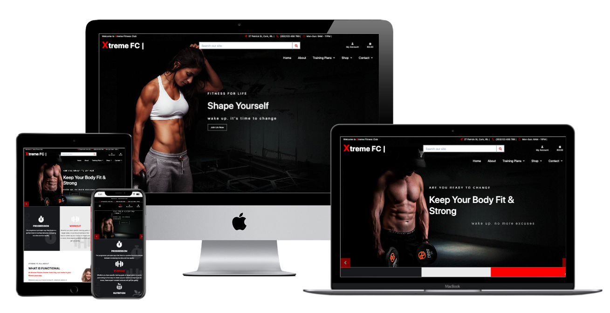


    - About


   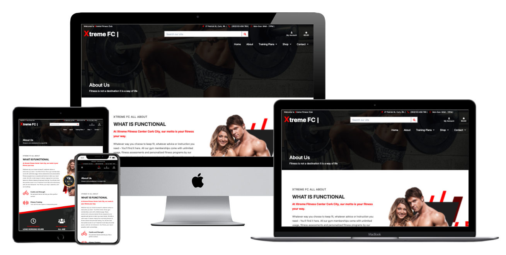


   - Training Plans

   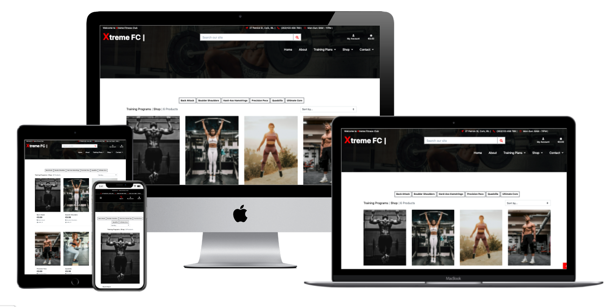


   - Shop

   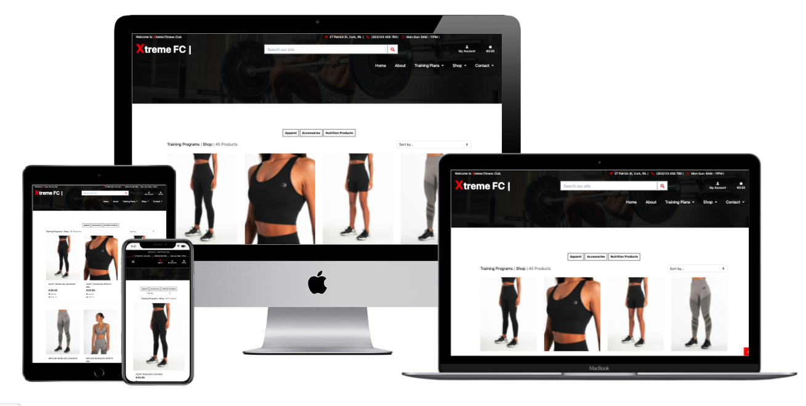


   - Product Details

   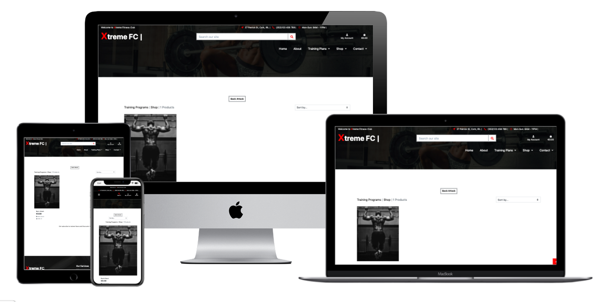
   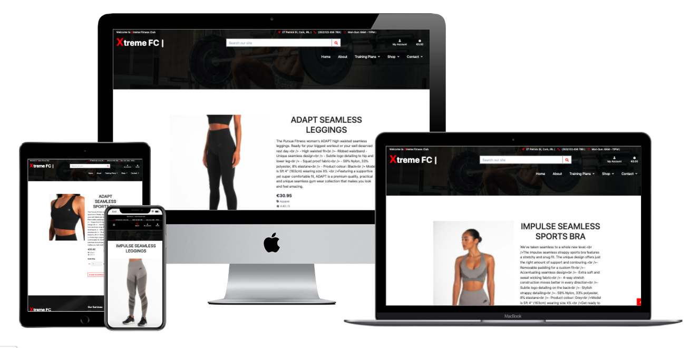

   - Bag

   

   - Contact

   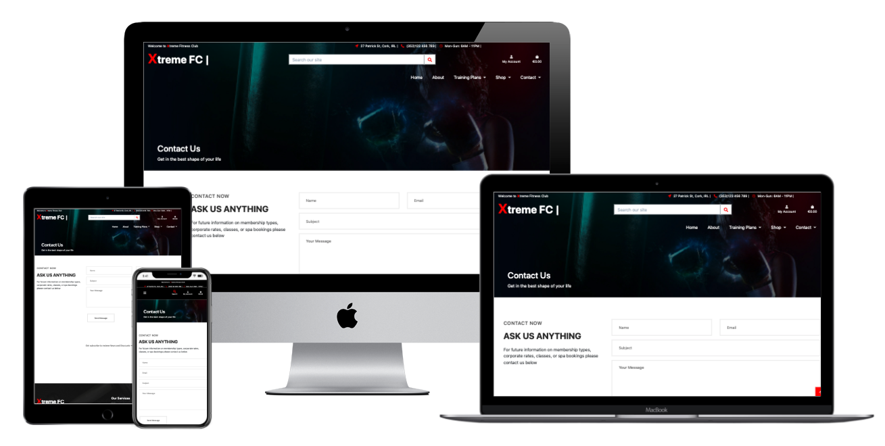

   - Blog

   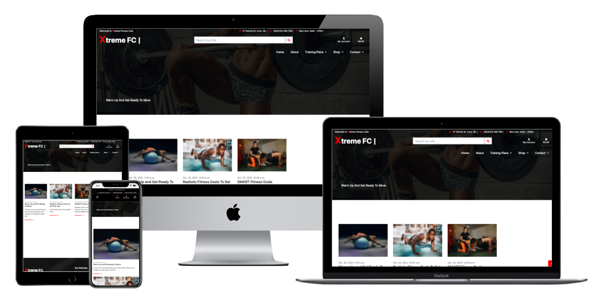

   - Blog details

   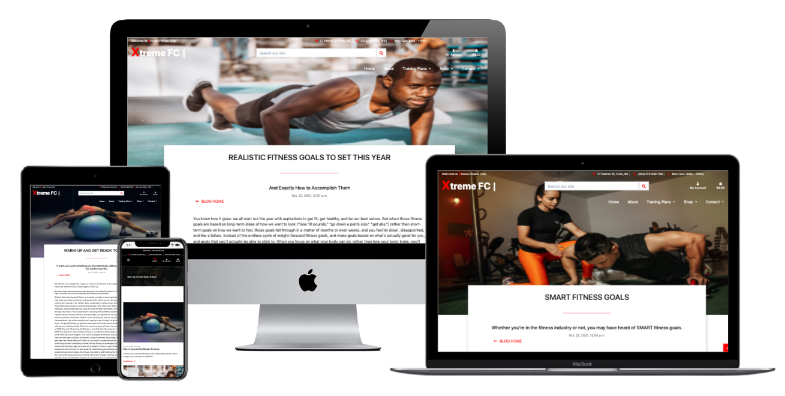

   - Login

   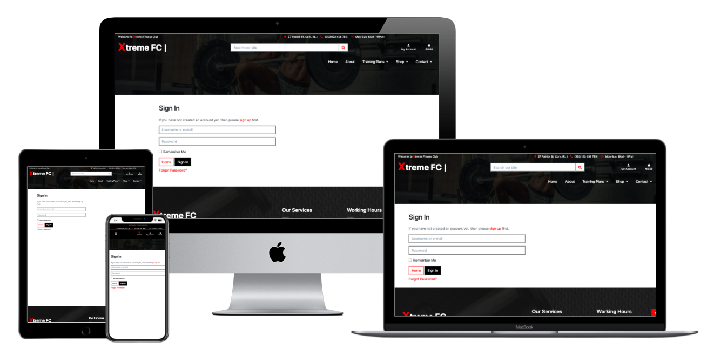

   - Register

   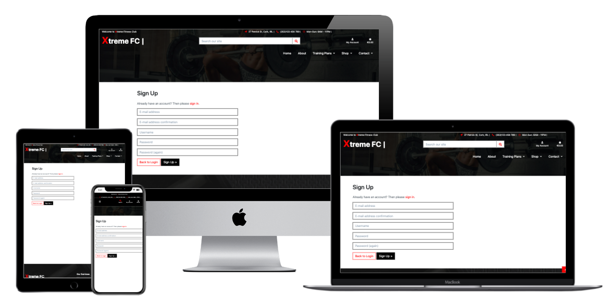


<div align="right"><a href="#top">🔝</a></div>

<a name="technologies"></a>

## Technologies Used

### Languages Used

-   [HTML5](https://www.w3schools.com/html/)
-   [CSS3](https://www.w3schools.com/css/)
-   [JavaScript](https://www.w3schools.com/js/DEFAULT.asp)
-   [jQuery](https://jquery.com/)
-   [Python](https://www.python.org/)

### Frameworks, Libraries and Programs Used

-   [Django](https://www.djangoproject.com/)
-   [Django Crispy Forms](https://django-crispy-forms.readthedocs.io/en/latest/)
-   [SQLite](https://docs.djangoproject.com/en/3.1/ref/databases/#sqlite-notes)
-   [PostgresSQL](https://www.heroku.com/postgres)
-   [Gunicorn](https://gunicorn.org/)
-   [Psycopg2](https://pypi.org/project/psycopg2/)
-   [Bootstrap framework](https://getbootstrap.com/)
-   [Gitpod](https://www.gitpod.io/)
-   [Git Version Control](https://git-scm.com/)
-   [GitHub](https://github.com/)
-   [Heroku](https://www.heroku.com/)
-   [Stripe](https://stripe.com/ie)
-   [AWS S3 Bucket](https://aws.amazon.com/s3/)
-   [Gmail](https://www.google.com/intl/ie/gmail/about/#)
-   [FontAwesome](https://fontawesome.com/)
-   [EmailJs](https://www.emailjs.com/)


<div align="right"><a href="#top">🔝</a></div>

<a name="testing"></a>

## Testing - [find here]()


<a name="deployment"></a>

## Deployment

<a name="local-deployment"></a>

### Local Deployment

This project was developed using [Gitpod](https://gitpod.io) as the chosen IDE and [GitHub](https://github.com) as a remote repository. The Project's source files were regularly pushed to the [GitHub Xtreme-Fitness Repository](https://github.com/szilG/Xtreme-Fitness) via the  `main`  branch. To reproduce this project within a local deployement, use the following steps and requirements:

1. Have the following installed in your IDE of choice:
	 - Git (for version control)
	 - pip (package installer for Python; pip3 was used at the time of production: October 2020)
	 - Python3 (the programming language used to produce the backend logic of this project)
2. Create an account with  [Stripe](https://stripe.com/ie), necessary for payment features in the project.
3. Use an email provider (I used [Gmail](https://www.google.com/intl/ie/gmail/about/#) for this project) and sign in and navigate to the  [Google Account Security](https://myaccount.google.com/security)  page.
4. Create two-step authentication by creating an App password for your Django app.
5. Use the same email values to set up your email username and password in the steps below:
	- Scroll to the top of this repository and click on the "clone or download button".
	- Decide whether you want to clone the project using HTTPS or an SSH key and do the following:
    - HTTPS: click on the checklist icon to the right of the URL to copy it
    - SSH key: first click on 'Use SSH' then click on the same icon as above

6. Return to your IDE and open a new Terminal window.
7. Change the current working directory to the location where you want the cloned directory.
8. Enter the following command and press 'Enter' to create your local clone:
```
git clone https://github.com/szilG/Xtreme-Fitness.git
```
9.  Install the required dependencies with the following command:
```
pip3 install -r requirements.txt
```
10.  Create an env.py file and add the following, complete with your own values:
```
import os
os.environ['DATABASE_URL'] = '<your Heroku Postgres database url>'
os.environ['EMAIL_HOST_PASS'] = '<your value>'
os.environ['EMAIL_HOST_USER'] = '<your value>'
os.environ['SECRET_KEY'] = '<your value>'
os.environ['STRIPE_PUBLIC_KEY'] = '<your value>'
os.environ['STRIPE_SECRET_KEY'] = '<your value>'
os.environ['STRIPE_WH_SECRET'] = '<your value>'
os.environ['DEVELOPMENT'] = 'True'
```
11.  Add your env.py file to .gitignore to make sure your database information is not viewable.
12. To set up the Django SQLite3 tables required for this project, use the following commands:
```
python3 manage.py makemigrations
python3 manage.py migrate
```
13.  After that, create a superuser for your project with the following command and follow the instructions in the Terminal (**note:** this will be necessary to add data to your locally deployed version):
```
python3 manage.py createsuperuser
```
14.  Your cloned version is now ready to run locally with the following command:
```
python3 manage.py runserver
```
15.  Once you run your project locally, add '/admin' to the locally deployed project's URL. 
16. Add categories and products or post and comments to the database.


<div align="right"><a href="#top">🔝</a></div>

<a name="heroku-deployment"></a>

### Heroku Deployment

To deploy this project to Heroku, use the following steps as a continuitation from local deployment outlined above:


1. Create an account and sign in to [Heroku](https://heroku.com). 
2. Inside the Heroku Dashboard, create a new app with a unique name and set the region to the closest to you, eg. 'Europe'.
3. To use the Postgres database for deployment, click 'Resources' tab and under 'Add-ons' seach for 'Heroku Postgres' Select Hobby Dev plan as a free add-on.
4. In Gitpod, freeze the requirements.txt file (the file is needed for Heroku to know which filed to install) with the following command:
```
pip3 freeze --local > requirements.txt
```
5. In Gitpod in your env.py set up
``` 

os.environ['DATABASE_URL'] = '<your Heroku Postgres database url>'
```
6. As with local deployment, set up the Postgres database with the following commands:
```
python3 manage.py makemigrations
python3 manage.py migrate
```
7. Import Product Data with the following commands:
```
python3 manage.py loaddata categories
python3 manage.py loaddata products
```
8. Create new superuser via 
```

python3 manage.py createsuperuser
``` 
and add username, email and password.
This will be production database for deploying on Heroku.

9. Create a Procfile with the following content (the file is needed for Heroku to know which file is needed as entry point):
```
web: gunicorn xtreme_fitness.wsgi:application
```
10. In your terminal login to Heroku with:
```

heroku login 
```
than, Disable the static files with:
```

heroku config:set DISABLE_COLLECTSTATIC=1 --app xtreme-fitness
```
11. In settings.py allowd the Host for the Heroku app.
```

ALLOWED_HOSTS = ['xtreme-fitness.herokuapp.com', 'localhost']
```
12. Add and Commit your changes and Push to the GitHub after Pusth to Heroku as well
```

git add .
git commit -m "your commit message"
git push (gitHub push)
git push heroku master
```
13. To automatic deploy click to the Deploy tab and on Deployment method section set it to connect to GitHub than search for the repo and click to connect. Make sure Enable Automatic Deploys.
14. Go to the 'Settings' tab, click on the 'Reveal Config Variables' button, and input the following values:

| **Key** | **Value** |
--- | ---
 DATABASE_URL | your Heroku Postgres database url
 EMAIL_HOST_PASS | your password to use your gmail account for emails
 EMAIL_HOST_USER | your email address
 SECRET_KEY | secret key used for your Django project (use Secret Key Genarator [like this](https://miniwebtool.com/django-secret-key-generator/))
 STRIPE_PUBLIC_KEY | obtained through your Stripe account
 STRIPE_SECRET_KEY | obtained through your Stripe account
 STRIPE_WH_SECRET | obtained through your Stripe account


### AWS Bucket

This project to work you need a cloud-based storage service like AWS S3 accont this will be necessary to store static files and media for deployment.

1. Go to [AWS S3 Bucket](https://aws.amazon.com/s3/) and Create an accont. 
2. Fill out the form with your credentials.
3. Once your accont is created go back to [AWS S3 Bucket](https://aws.amazon.com/s3/) and Sign-in (upper rigth). 
4. On AWS Managnemt Console find or search for S3. Than click on it.

   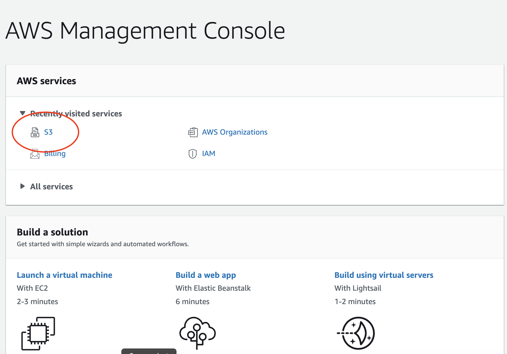

5. Create a bucket with a name (best practice naming your bucket to match your Heroku app name), choose the region the one closest to you and MAKE SURE uncheck Block All Publick Access (it's need to public to allow public access to the static files). Click Create bucket.

   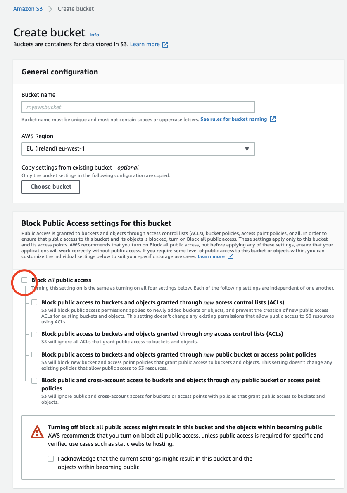

6. Click on the newly created bucket than click the properties tab. 
7. Locate the static Website Hosting option and click on Edit.
8. Turn on Static Website Hosting, that will give a new endpoint to access it from the internet. Input index.html to the Index Document field and error.html to the Error Document field (default values). Save the changes. 

   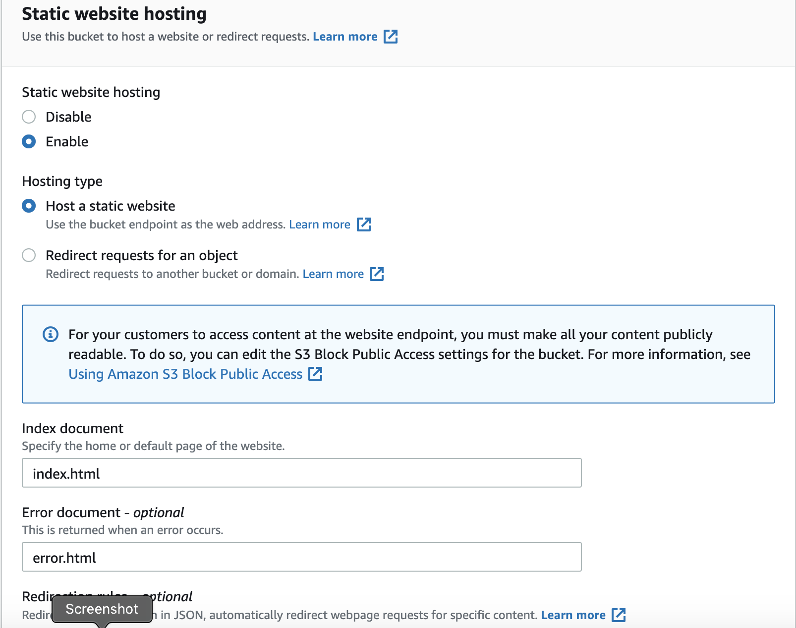

9. Click to the Permissions tab and locate the Cross-origin resource sharing (CORS) option and click Edit.
Find more info [Cross-Origin Resource Sharing (CORS)](https://docs.aws.amazon.com/sdk-for-javascript/v2/developer-guide/cors.html),
and for sample configurations, see [Using cross-origin resource sharing (CORS)](https://docs.aws.amazon.com/AmazonS3/latest/userguide/cors.html#how-do-i-enable-cors)
10. Click to the Bucket Policy tab and select policy generator and create a security policy for this bucket.
 - Policy type : S3 Bucket Policy
 - Principal:  *
 - Action: Get Object
 - Amazon Resorce Name(ARN): <your ARN name > (You can find it in the bucket policy tab).
 - Click Add statement than click Generate Policy.
 - Copy that policy into the Bucket policy editor.
 - Add a ( /* ) to the end of the Resource key (that allows access to all resources in the bucket).
11. Locate the Access Control List option and click Edit.
 - On Everyone (public Access) tick the list object permision and Save.
12. Under Services menu go to IAM (allow identity and access management of our stored files and folder).
 - In the left side menu Click on Groups and than Create a new group.
 - In the left side menu Click on Policy.
 - Click on Create Policy and choose the Json tab and click on to import manage policy. 
 - Search for S3 than choose AmazonS3FullAccess than import.
 - Click Review policy give a neme and description than click create policy.
  (Your policy is created, attach that policy to your group)
 - Go to Groups and click your group, after find and click Attach policy button. Search for the policy just you created then select and then click attach policy.
 - In the left side menu Click on Users and Add Users.
 - Create a user and Access Type: Programmatic Access click next.
 - Under Add user to group section just tick your group name and click next on and finish with click on Create User. 
 - Then it generates a downlaodable zip file (Donwload.csv) containing ID and KEY to use for the newly added group. This ID and KEY as to be stored in your env.py file and in Heroku Config Vars. **Download and keep it safe**
13. Back in your Gitpod in the settings.py file change the AWS_STORAGE_BUCKET_NAME to your bucket name, the AWS_S3_REGION_NAME to your region.
14. On Heroku go to Settings and click on Config Vars and add your AWS keys to the config variables (you can find your keys in the Downloaded zip file) and add USE_AWS and set it true. Remove the DISABLE_COLLECTSTATIC variable.

| **Key** | **Value** |
--- | ---
 AWS_ACCESS_KEY_ID | your AWS bucket ID
 AWS_SECRET_ACCESS_KEY | your AWS secret key
 DATABASE_URL | your Heroku Postgres database url
 EMAIL_HOST_PASS | your password to use your gmail account for emails
 EMAIL_HOST_USER | your email address
 SECRET_KEY | secret key used for your Django project 
 STRIPE_PUBLIC_KEY | obtained through your Stripe account
 STRIPE_SECRET_KEY | obtained through your Stripe account
 STRIPE_WH_SECRET | obtained through your Stripe account
 USE_AWS | True


<div align="right"><a href="#top">🔝</a></div>

<a name="credits"></a>

## Credits

### Code

- This project was possible thanks to following the mini-project [Boutique Ado]( https://github.com/mkthewlis/boutique-ado), which was part of the course material while studying with *Code Institute*.
- [Bootstrap library was used to create a responsive design.](https://getbootstrap.com/docs/5.1/getting-started/introduction/)
- [Animate.css](https://animate.style/)
- For newsletter I got inspiration from [MasterCodeOnline](https://www.youtube.com/watch?v=q2B1VpjDjMQ&list=PL_557Q1uZ7gKYcVQtDYFvYONKtwtguF03&index=4)
- For Blog I was inspired about [Code with Stein](https://www.youtube.com/watch?v=m3hhLE1KR5Q)
- For custom Alert messages i used [SweetAlert](https://sweetalert.js.org/docs/)


### Content

- I was inspired about those sites:
  - [envato market](https://themeforest.net/item/gym-expert-fitness-gym-html-template/26783766?clickid=V81TFQSU6xyLRwNxiAS6PRWLUkBU-USVNS-tT00&_ga=2.149086262.1687756335.1632150891-93246842.1628010830)
  - [Activate](https://activate.ie/)
  - [ClubVitate](https://www.clubvitae.com/corkclayton)
  - [coachsfitnesscentre](https://www.coachsfitnesscentre.com/)

- Nutritional product images and description came from [hammernutrition](https://www.hammernutrition.eu/)
- Shop Apperals and Accesories images and description came from [pursuefitness](https://www.pursuefitness.co.uk/)
- The traning Plans Idea cames from [coachsfitnesscentre](https://www.coachsfitnesscentre.com/)

- Blog Content
  - [goldsgym](https://www.goldsgym.com/linglestown/blog/setting-smart-fitness-goals/)
  - [theeverygirl](https://theeverygirl.com/15-realistic-fitness-goals-to-make-this-year-and-exactly-how-to-accomplish-them/)
  - [fitnessfirs](https://www.fitnessfirst.com.sg/blog/warm-up-and-get-ready-to-move)

### Media

- Images from
  - [pixabay](https://pixabay.com/images/search/fitness/)
  - [unsplash](https://unsplash.com/)
  - [award image](https://expert-themes.com/html/gym/images/resource/award.png)
  - [fitness couple image](https://expert-themes.com/html/gym/images/resource/about-1.png)
  - [footer image](https://expert-themes.com/)
  - [About page our trainer images came from](https://expert-themes.com/)

- Icons from
  - [font Awesome](https://fontawesome.com/)
  - [flatIcons](https://www.flaticon.com/)
  - [favicon](https://favicon.io/favicon-generator/)

### Acknowledgements

- Many Thanks to my mentor **Akshat Garg** for his patience and gentleness, for staying available and supportive through my unique process and giving me important suggestions and feedback of my work. I've learnt a huge amount working with him.
- To [Code Institute](https://codeinstitute.net/), their team and staff for their fantastic and ongoing 24hour support.
- Many thanks to my fellow student **Daniella Minyo** she was brilliant and extremely patient😀, she helped me a lot throughout this coding jorney.

> **_NOTE:_** This project was created for educational purposes only.

<div align="right"><a href="#top">🔝</a></div>
