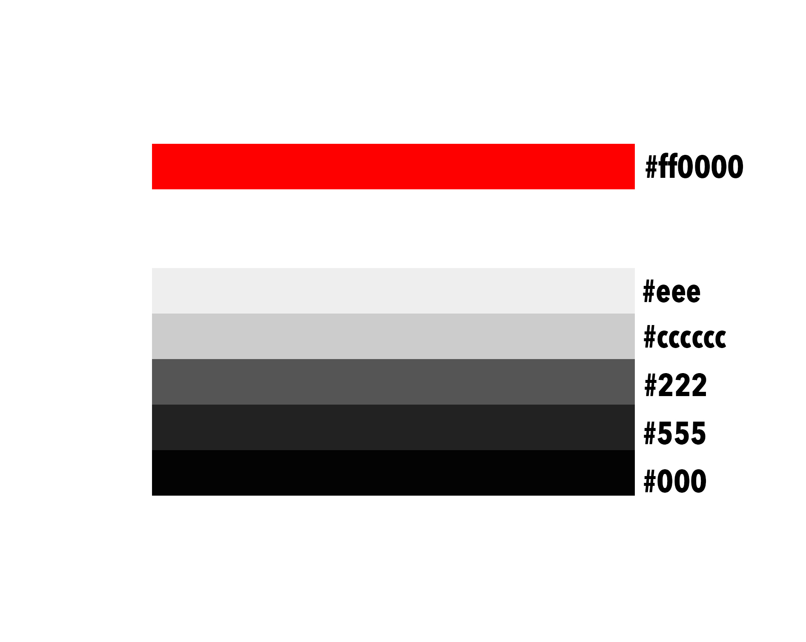
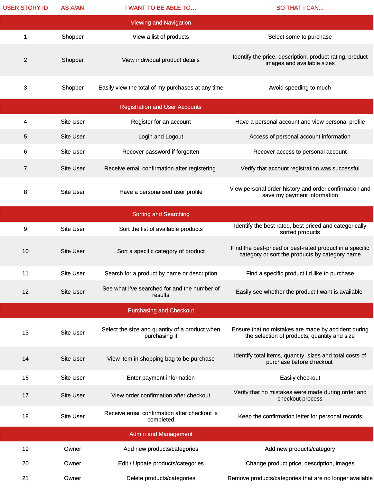
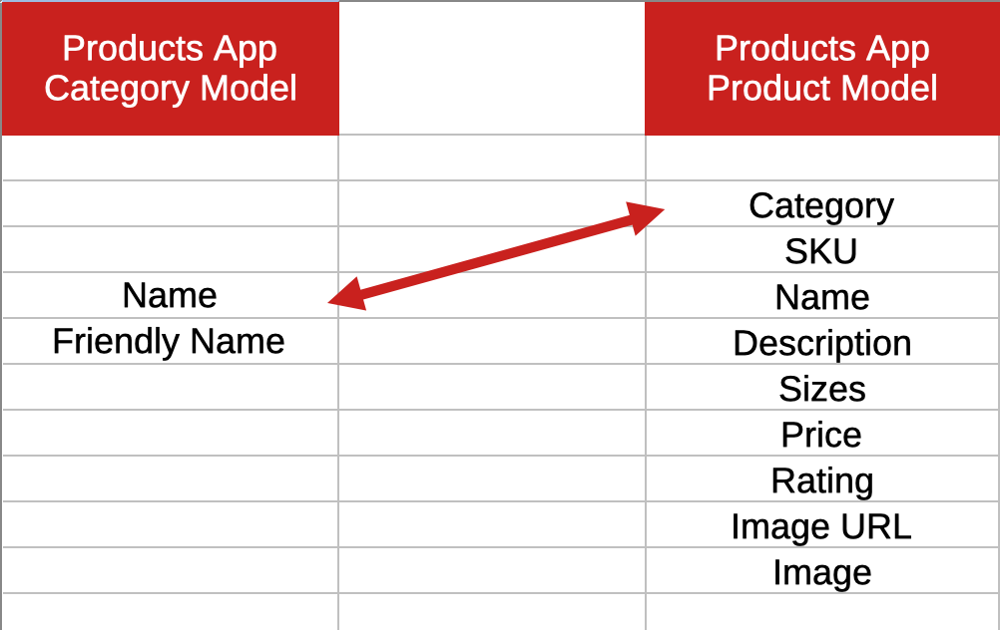

<h1 align="center">Xtreme Fitness Club</h1>
<h1 align="center"></h1>

## Introduction
*Xtreme Fitness Club* they are fitness enthusiast who would love to share their love of health and fitness with others.
The website designed for business purpose offering personal trainning programs, group tranning programs, apparels and nutritional products.
What more perfect place to purchase these things than a trusted fitness center? The main goal is to make this business venture profitable and .

This is my final project of four Milestone Projects that make up the Full-Stack Web Development Diploma Training at [Code Institute](https://codeinstitute.net/). The goal of this project was to build a full-stack website with the use of HTML, CSS, JavaScript, Python, Django and a relational database; as well as the implementation of a checkout functionality, which has been achieved through the use of Stripe.

Xtreme Fitness is Python-Django web application, support by a PostgreSQL (and SQLite3) database, and deployed via the Heroku PaaS. This project uses the Stripe Checkout API (for educational purposes only: not currently taking real card payments) and is styled using the Bootstrap Grid System.

**NOTE:** If you would like to test the payment functionality of this project, NO NEED to create an account. Use the card number 4242 4242 4242 4242 with ANY address details, expiry date and CVC that you choose.

[Click here to view the project live.](https://xtreme-fitness.herokuapp.com/)

<a href="#top">🔝</a>

## Table of Contents

- [Introduction](#introduction)

- [User Experience](#ux)

  - [Wireframe](#wireframe)
  - [Color Palette](#color-palette)
  - [App Logo](#app-logo)

- [User Stories](#user-stories)

- [Database Structure](#database-structure)

  - [Profiles App](#profiles-app)
  - [Products App](#products-app)
  - [Blog App](#blog-app)
  - [Subscribe App](#subscribe-app)

- [Features](#features)

- [Mockup](#mockup)

## User Experience (UX)

### Wireframe
Link to the wireframe on [here](https://github.com/szilG/Xtreme-Fitness/tree/main/readme/wireframes)

### Color Palette

### App Logo
*Xtreme Fitness Club Favicon*

 

<a href="#top">🔝</a>

## User Stories

Three main users were created:

1.	Superuser (admin) can add products, description of product, price and image.
2.	General browsing users who are potential customers who have browsed on to the website but did not register
3.	Authenticated users who are customer of the site by registering (adding their contact details and creating a user and password)

<a href="#top">🔝</a>

## Database Structure 

Xtreme Fitness Club site is built on Django, and uses the SQLite3 database during all development stages. Through the deployment to Heroku, the database was changed to a PostgreSQL database as that is provided by Heroku as an add-on for production.

The Django’s default user model for authorization is also in use, which allows the project to meet one of the main requirements of separating features by anonymous users, users in session and superusers.

The structure of the apps are inspired by one of Code Institute's mini projects: _Boutique Ado_.

### Profiles App

#### UserProfile Model

| **Name** | **Database Key** | **Field Type** | **Validation** |
--- | --- | --- | --- 
 User | user | OneToOneField 'User' |  on_delete=models.CASCADE
 Phone number | default_phone_number | CharField | max_length=20, null=True, blank=True
 Address Line1 | default_street_address1 | CharField | max_length=80, null=True, blank=True
 Address Line2 | default_street_address2 | CharField | max_length=80, null=True, blank=True
 Postcode | default_postcode | CharField | max_length=20, null=True, blank=True
 Town/City | default_town_or_city | CharField | max_length=40, null=True, blank=True
 County | default_county | CharField | max_length=80, null=True, blank=True
 Country | default_country | CountryField | blank_label='Country', null=True, blank=True

### Products App

#### Product Model

| **Name** | **Database Key** | **Field Type** | **Validation** |
--- | --- | --- | --- 
 Category | category | ForeignKey 'Category' | null=True, blank=True, on_delete=models.SET_NULL
 Sku | sku | CharField | max_length=254, null=True, blank=True
 Name | name | CharField | max_length=254
 Description | description | TextField |max_length=700
 Sizes | has_sizes | BooleanField | default=False, null=True, blank=True
 Price | price | DecimalField | max_digits=6, decimal_places=2
 Rating | rating | DecimalField | max_digits=6, decimal_places=2, null=True, blank=True
 Image URL | image_url | URLField | max_length=300, null=True, blank=True
 Image | image | ImageField | null=True, blank=True

#### Category Model

| **Name** | **Database Key** | **Field Type** | **Validation** |
--- | --- | --- | ---
Name | name | CharField | max_length=254
Friendly Name | friendly_name | CharField | max_length=254, null=True, blank=True

### Blog App

#### Post Model

| **Name** | **Database Key** | **Field Type** | **Validation** |
--- | --- | --- | ---
Title | title | CharField | max_length=254
Slug | slug | SlugField | null=True, blank=True
Intro | intro | TextField |
Image_url |image_url | URLField | max_length=1024, null=True, blank=True
Image |image | ImageField | null=True, blank=True
Body |body| TextField | 
Body_sub_header |body_sub_header | TextField| null=True, blank=True
Body_text | body_text | TextField | null=True, blank=True
Date_added | date_added | DateTimeField | auto_now_add=True

#### Comment Model

| **Name** | **Database Key** | **Field Type** | **Validation** |
--- | --- | --- | ---
Post | post | ForeignKey Post, related_name='comments' | null=True, blank=True, on_delete=models.SET_NULL
Name |name | CharField | max_length=254
Email | email | EmailField
Body |body| TextField 
Date_added | date_added | DateTimeField | auto_now_add=True

### Subscribe App

#### Subscribe Model

| **Name** | **Database Key** | **Field Type** | **Validation** |
--- | --- | --- | ---
Email | email | EmailField | max_length=254, unique=True
Date_added | date_added | DateTimeField | auto_now_add=True

<a href="#top">🔝</a>

## Features

### Existing Features

#### Consistent features across all pages

- The menu at the top of the page and footer at the bottom are consistent in design and are responsive throughout the website.
- The header is positioned to always be visible at the top of the screen (mobile and desktop) which allows visitors to find it quickly.
- There are two header on page. One is main navigation menu and other is mobile top header.
- The navbar contains the logo, search box, links to access user acconts and shopping bag and the navigation links.
- On click to My Acconts the user will find the Sign In or Register forms, prompting them to access the parts of the website that require authentication.
- Regular registered users can check and edit their profile details and check their order history.
- Admin with superuser privileges can add, edit and delete products, categories from the database.
- Registered users can click Log out under My Acconts that verifies that a user wishes to leave the site, with a 'Sign Out' button. Once signed out, users are redirected back to the Home page.
- A Search box is part of the top navigation and accessible on all pages. It allows customers to enter keywords associated with the products they wish to purchase. The Search box is dynamically connected to the database.
- The authentication pages (Sign In, Sign Up & Sign Out) were built with Django, and therefore include all Django's builtin features (including requesting an email for forgotten passwords.)
- Each page features a 'scroll to top' button that becomes visible when the user has scrolled down the page.
- Each page on large device when the user 'scroll down' the transparent background change to black. That allows the navbar to be visible when the user has scrolled down the page.
- All toast messages appear in the right corner under the menu bar. Depending on the type of message, the toast colour changes to reflect this message. The purpose of is to provide the user confirmation of actions like sign out etc.
- All of the Social links are in the footer and they're change color on hover.

#### Specific to the pages

**Home Page**

 - The user begins by seeing the carousel images with a Join Us action button.
 - Then scrolls down to see 3 services section each field is clickable call to action button. 
 - Below this, the user sees a little about info that features buttons to the trainning plans page.
 - Below this, the user sees a membership section wich tells the user what are the benefits if they become a member and features with a call to action button.
 - Below this, the user sees the testimonials of previous customers with their names and pictures.
 - Bellow this, the user sees the contact section with a map, contact info and a contact form. That section contains the subscribe newsletter button.

**About Page**

 - The user begins by seeing the motivation hero image with a caption text.
 - Then scrolls down to see a little about info that features buttons to the trainning plans page.
 - Bellow this, the user sees 3 services section each field is clickable call to action button.
 - Bellow this, the user sees the trainers section with their images, names and their socials links.
 - Bellow this, another section from the fitness club benefits and the contact us button. That section contains the subscribe newsletter button.

**Trainning Plan page (All Trainning)**

 - The user begins by seeing the motivation hero image.
 - This page contains the list of programs based on category with image and price.

**Shop Page (All Products)**

 - The user begins by seeing the motivation hero image.
 - This page contains the list of programs based on category with image and price.

**Product Description Page**

 - This page displays product description of selected product with price, rating, size if has any, quantity box and add to bag and keep shopping link.

**Contact Page**

 - The user begins by seeing the motivation hero image with a caption text.
 - This page contains a contact form where users can ask questions. Also the page contains a map and contact information about Xtreme Fitness Club.
 - That page contains the subscribe newsletter button.

**Blog Page**

 - The user begins by seeing the motivation hero image with a caption text.
 - Bellow this, the blog content with image, intro text, the date when it was added and a read more action button.

**Blog Details page**

 - The user begins by seeing the blog image on the top.
 - Bellow this, the blog post with a header text, intro text, the date when it was added, and a bake to Blog Home button.
 - Bellow this, the comment section when the users can leave comments for the particular post.

**Register Page**

 - This page has signup form. After registration user will reach the sign in page.
 - After sign in the user will reach the home page.

**Log In Page**

 - This page has login form. After login user will reach on home page.

**Profile Page**

 - This page contains user details, delivery info with an update information button and the user order history.

**Log Out Page**

 - This page has logout form with confirmation Sing Out button to logout. Once signed out, users are redirected back to the Home page.

**Product Managment Page**

 - Only admin can access this page. Admin with superuser privileges can add, edit and delete products, categories from the database.

**Bag Page**

 - This page has list of all products added to the bag with image, price, quantity, delivery info and amount of the total price. 
 Also contains a secure checkout and keep shopping link.

**Checkout Page**

 - This page contains a form of user details, delivery information and the payment method. Also users can save their delivery information to their profile.
 - Bellow that, a Compate order and a Back button.
 - This page also contains order summary of the purchased products.
 - A red overlay with a spinner gif appears after checkout is initiated and while the transaction is being processed and until the checkout success page has fully loaded.

**Checkout Success Page**

 - This page has confirmation Thank You message of your payment for order. This page contains the orders and user deatils and a go back to home page link.
 - Also on the upper right corner toast message appears with a success or failure.

**Subscribe Page**

 - This page has a hero image with a text caption.
 - Bellow that, a call to action text with a header and a paragraph.
 - Bellow that, aa subscribe form for getting the newsletter. Just by entering email address you become subscriber.

<a href="#top">🔝</a>

### Features Left to Implement

- Built in a costumer comment section to the product details page where the costumers can leave feetbacks and images of the product, company, delivery info, ect.
- Create a clickable timetable where the users can book any classes or cancel their bookings.
- Create a page with online video tainnings and/or nutrition coaching app.

## Mockups

- Mockup made through original website on [Techsini](https://techsini.com/multi-mockup/index.php)

    - Home

   

    - About

   

   - Training Plans

   

   - Shop

   

   - Product Details

   
   

   - Bag

   

   - Contact

   

   - Blog

   

   - Blog details

   

   - Login

   

   - Register

   