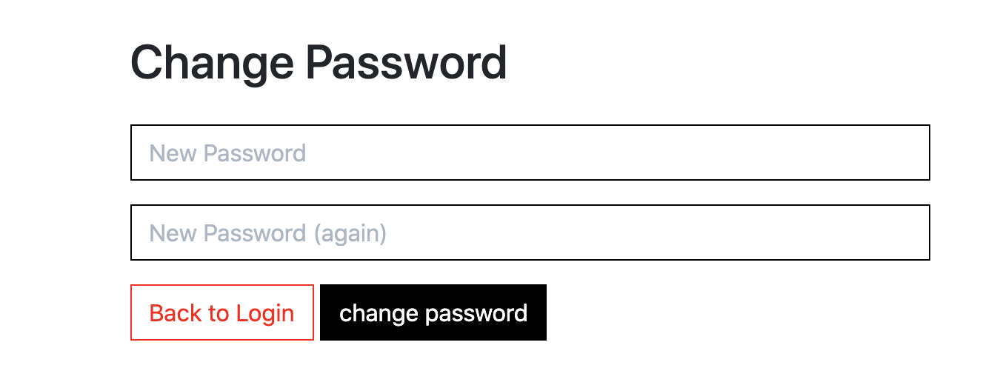
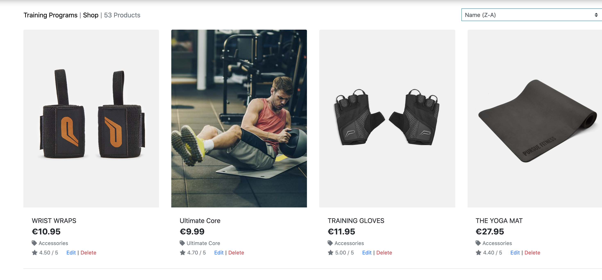
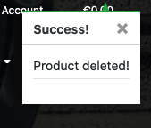

<h1 align="center">Xtreme Fitness Club<a name="#top"></a></h1>

- Back To [Readme](README.md)

## Table of Contents

- [Testing](#testing)

  - [Gmail - EmailJs](#gmail)
  - [Functionality Testing](#func-test)
  - [Usability Testing](#usability-testing)
  - [Compatibility Testing](#compatibility-testing)
  - [Performance Testing](#performance-testing)
  - [User Stories](#user-stories)

- [Validator](#validator)
  - [CSS3 validator](#css3-validator)
  - [HTML5 validator](#html-validator)
  - [JavaScript validator](#js-validator)
  - [Python validator](#py-validator)

<a name="testing"></a>

## Testing

<a name="gmail"></a>

- Gmail - EmailJs:

  - EmailJs Error in Gmail accont: 
    - No name , email and message value.

     
  ```
  function validate() {
        let name = document.querySelector(".name");
        let email = document.querySelector(".email");
        let subject = document.querySelector(".subject");
        let message = document.querySelector(".message");
        let btn = document.querySelector(".message-btn");

        btn.addEventListener("click", (e) => {
              e.preventDefault();
              if (name.value == "" || email.value == "" || subject.value == "" || message.value == "") {
              emptyerror();
              } 
              else {
                    sendMail(name.value, email.value, subject.value, message.value);
                    success();
                    document.getElementById("myForm").reset();
                    return false;     
              }
        });
  }
  validate();

        
  function sendMail(name, email, subject, message) {
        emailjs.send("service_4l1t10j", "template_nv8417p", {
              name: name.value,
              email: email.value,
              subject: subject.value,
              message: message.value,
        })
        
  }
  ```
  - Quick fix:
    - Delete .value after the value of name, email, subject, message from sendMail function.
    - In the validate function use this value.

         
  ```

  function sendMail(name, email, subject, message) {
        emailjs.send("service_4l1t10j", "template_nv8417p", {
              name: name,
              email: email,
              subject: subject,
              message: message,
        })
        
  }
  ```


<div align="right"><a href="#top">🔝</a></div>

<a name="func-test"></a>

### Functionality Testing

- Navigation bar
  - Click to the logo on left upper corner it takes to Home page.
  - The nav links clicks it opens the relevent page in same window with same header footer.

- Footer
  - Footer is located at the bottom of the page regardless of the content amount.
  - When the social links are clicked, they open the relevant social media page in a new tab.

- Links
  - All external links is tested to make sure they open up the correct pages in new tabs.
  - All internal links is tested to make sure that all pages are correctly connected.


<a name="usability-testing"></a>

### Usability Testing

- This is website shared with friends to check on different device and accessbility.


<a name="compatibility-testing"></a>

### Compatibility Testing

- Browser Compatibility
   - Tested on Chrome, Firefox, Safari.

- OS Compatibility
   - Tested on iOS , Android.


<div align="right"><a href="#top">🔝</a></div>

<a name="performance-testing"></a>

### Performance Testing

- Tested on Developer Tools Lighthouse.

   - To run a report
     - Download Google Chrome for Desktop.
     - In Google Chrome, go to the URL you want to check. You can check any URL on the web.
     - Open Chrome DevTools.
     - Click the Lighthouse tab.
     - To the left is the viewport of the page that will be checked. To the right is the Lighthouse panel of Chrome DevTools.
     - Choose Desktop or Mobil device, DevTools shows you a list of categories. Leave them all enabled.
     - Click Generate report.

- A Lighthouse report in Chrome DevTools

    - Home page Desktop and Mobile
      

    - About page Desktop and Mobile
      

    - Products(all) page Desktop and Mobile
      

    - Product_details page Desktop and Mobile
      

    - Contact page Desktop and Mobile
      

    - Blog page Desktop and Mobile
      

    - Blog_details page Desktop and Mobile
      

    - Bag page Desktop and Mobile
      

    - Checkout page Desktop and Mobile
      

    - Checkout_success page Desktop and Mobile
      

    - Subcribe page Desktop and Mobile
      

    - Product mangment page Desktop and Mobile
      

    - Profile page Desktop and Mobile
      

    - Register page Desktop and Mobile
      

    - Sign-In page Desktop and Mobile
      


<div align="right"><a href="#top">🔝</a></div>

<a name="user-stories"></a> 

### Testing User Stories

- Generic User, Shopper, Site User

  - I easily understand the purpose and the layout of the site without additional instructions needed.
  - All pages of website has navigation bar, search box and footer.
  - With navigation bar I can easily access diiferent page and go anywhere from present page and come back.
  - Footer has social link. If I click on link it open the relevant page on different tab so I can easily check the social activity.
  - I am able to use the website on any device.

    - View a list of products:
      - Training page(all) - I get all training plans of the Fitness club.
      - Shop page(all). - I get all shopping products of the Fitness club.

    - View individual product details:
      - Product_details. -  I can see product description of specific product.

    - Easily view the total of my purchases at any time:
      - On all pages.  - I can see the bag icon in the rigth corner with my total amont of the purchases.

    - Register for an accont:
      - Register pages.  - Have a personal accont and view my profile.

    - Log-in and Log-out:
      - Log-In pages.  - I can Log-in to my profile. 
      - Log-out page.  - When I click to Log-out a log-out page opens and ask me to Log-out.
  
    - Receive confirmation email after registering:

      

      

      

      


    - Recover password if forgotten:

      

      

      

      

    - Have a personalized user profile:
      - View personal order history and order confirmation and save my payment information.
      - I can see my address details which I can update.
    
    - Sort the list of available products:
      - Identify the best rated, best priced and categorically sorted products.

      

      

      

      

      

      

      

      

    - Sort a specific category of product:
      - Find the best-priced or best-rated product in a specific category or sort the products by category name.
        - Training Plans :

          

          

          

        
        - Shop:

          

          

          

          


    - Search for a product by name or description:
      - Find a specific product I’d like to purchase.    


    - See what I’ve searched for and the number of results:
      - Easily see whether the product I want is available.

    - Select the size and quantity of a product when purchasing it:
      - Ensure that no mistakes are made by accident during the selection of products, quantity and size.

          

    - View item in shopping bag to be purchase:
      - Identify total items, quantity, sizes and total costs of purchase before checkout.

          

    - Enter payment information:
      - Easily checkout

          

    - View order confirmation after checkout:
      - Verify that no mistakes were made during order and checkout process.

          

    - Receive email confirmation after checkout is completed:
      - Keep the confirmation letter for personal records.

          


- Site Owner

    - Add new products/categories:
      - I can add Products to a specific category.

         

         

      - I can add Category only in Django Admin panel.

    - Edit / Update products/categories:
      - I can Edit and Update Products of specific category.

         
      
      - I can Edit/Update Category only in Django Admin panel.
    
    - Delete products/categories:
      - I can Delete Products of specific category.

         

         

      - I can Delete Category only in Django Admin panel.


<div align="right"><a href="#top">🔝</a></div>

<a name="validator"></a>

### Validator

<a name="css3-validator"></a>

#### CSS3 validator
Validate by direct input [CSS Validator](https://jigsaw.w3.org/css-validator/)
- First Test results: 2 Errors

    
   - Quick fix: 
       - border-radius: none  -to - botder-radius: 0
       - transform: transition .3s ease  -to - transition: .3s ease

- Second Test results: No Errors

   

I got 24 Warning about Vendor Extensions

<a name="html-validator"></a>

#### HTML5 validator
Vaidate by URI [HTML5 Validator](https://validator.w3.org/#validate_by_uri)
Test result : No Error

<a name="js-validator"></a>

#### JavaScript validator
Validate by direct input [JavaScript Validator](https://jshint.com/)
- Test result : No Error Found But Warning

<a name="py-validator"></a>

#### Python validator
Validate by direct input [Python Validator](http://pep8online.com/)
Test result : No Error

<div align="right"><a href="#top">🔝</a></div>


